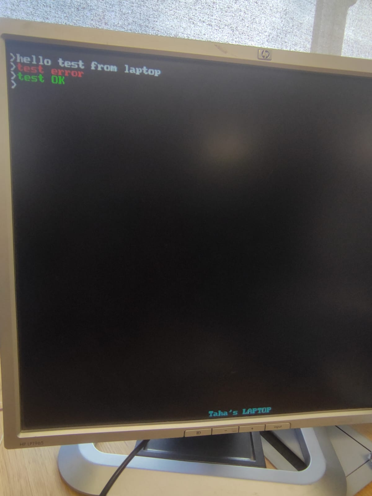
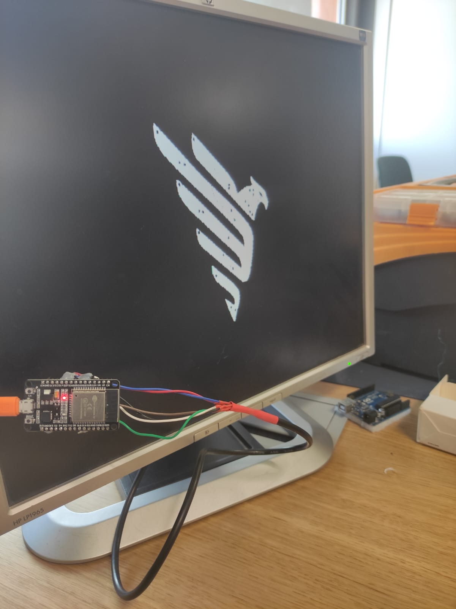
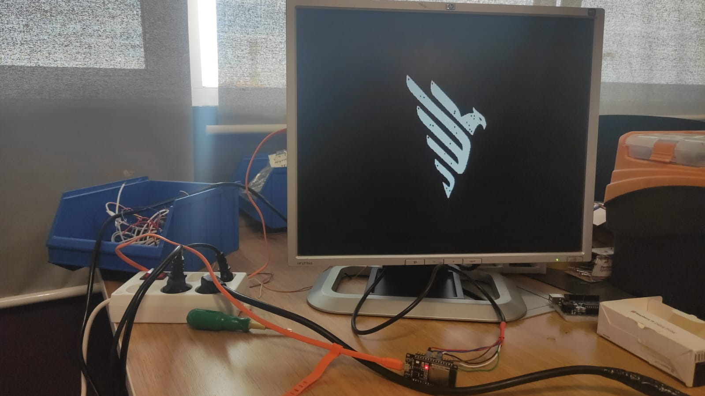

# 🖥️ ESP-VGA-Displayer

A lightweight ESP32 project that drives a **VGA display** and accepts simple **text commands over TCP/IP**.  
Any device on the same network can send commands to **update the VGA text output remotely** — perfect for building custom dashboards, status screens, or retro-style displays.

---

## 📸 Preview

<table>
  <tr>
    <td align="center"><br><b>VGA Text Test</b></td>
    <td align="center"><br><b>ESP32 Board</b></td>
  </tr>
  <tr>
    <td align="center"><br><b>VGA Screen back</b></td>
    <td align="center"><br><b>VGA Screen front</b></td>
  </tr>
</table>

## ✨ Features
- 🧠 **VGA output** powered directly by the ESP32
- 🌐 **TCP-based text protocol** — send commands from any networked device  
- ⚙️ **Simple integration** — works with `netcat`, `telnet`, or custom clients  
- 🎨 **Color control** — set text color with a simple command  
- 🔁 **Live updates** — clear the screen or print text in real time  

---

## ⚡ Requirements
- An **ESP32-based board** (e.g. DOIT ESP32 DEVKIT V1)  
- **VGA adapter** wired to the ESP32 (project-specific wiring not included)  
- ESP32 connected to the **same network** as the client  

---

## 📡 Protocol

The ESP32 listens for TCP connections on **port 1337**.  
Commands are sent as **newline-terminated lines** (`\n`).

### Optional identification
```
/identify [device_name]
```
Gives your client a name for easier tracking.

### Supported commands

| Command | Description |
|----------|-------------|
| `/clear` | Clears the VGA screen |
| `/print text` | Prints the rest of the line as text |
| `/color name` | Sets the current text color. Supported colors: `black`, `blue`, `green`, `cyan`, `red`, `magenta`, `yellow`, `white` |

---

### 💡 Examples

**Clear the screen:**
```
/clear
```

**Print text:**
```
/print Hello, world!
```

**Change text color:**
```
/color red
/print Warning: Overheating detected!
```

**Reset color:**
```
/color white
/print Normal operation resumed.
```

**Using netcat (replace `<IP>` with your ESP32’s address):**
```bash
nc <IP> 1337
/clear
/color green
/print Remote text sent from netcat
```

---

## 🎨 Color Mapping

Here’s the internal color table used by `/color`:

```c
_color textColors[8] = {
  {"black",   {0, 0, 0}},
  {"blue",    {0, 0, 255}},
  {"green",   {0, 255, 0}},
  {"cyan",    {0, 255, 255}},
  {"red",     {255, 0, 0}},
  {"magenta", {255, 0, 255}},
  {"yellow",  {255, 255, 0}},
  {"white",   {255, 255, 255}},
};
```

---

## 🧱 Building & Flashing (PlatformIO)

From the project root:

```bash
# Build
pio run

# Upload to the device
pio run -t upload
```

Make sure your `platformio.ini` matches your board and serial port configuration.

---

## 🧠 Tips
- Ensure the ESP32 has a **valid IP address** and is **reachable** from your client device.  
- Each command must end with a **newline (`\n`)**.  
- For more robust clients, implement **retries or acknowledgements** if you need reliable delivery.  
- Use `/color` to highlight different message types (e.g., status updates, errors, info).

---

## 🧭 Future Plans
The project is still evolving! Some planned features include:
- 📜 **Scrolling text support** — allowing smooth text movement and overflow handling  
- 🪟 **Split-screen mode** — divide the VGA display into regions for multiple text streams or widgets  
- 🧩 **Extended color support** — support RGB values or predefined themes  
- ⚙️ **New commands** for text layout and cursor positioning  

---

## 🤝 Contributing
Pull requests and issues are welcome!  
If you add new commands or extend the text protocol, please document them clearly so others can build on your work.

---

## 🧩 License
MIT License — free to use, modify, and share.

---
